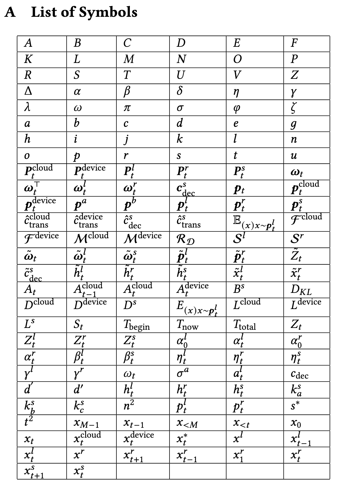

# SymbolNav

SymbolNav is an extractor/navigator for math symbols defined in LaTeX.

## TODO
There're still some bugs (especially for float-point numbers).

## Installation

Install dependencies:
```bash
pip install ply rich
```

Clone the project (pypi is not supported currently):
```bash
git clone git@github.com:ThomasAtlantis/SymbolNav.git
```

Install locally
```bash
cd SymbolNav && pip install -e .
```

## Features

- Basic arithmetic operators: `+`, `-`, `*`, `/`, `\times`, `\cdot`, `\div`, `:`
- Relational operators: `=`, `<`, `>`, `\leq`, `\geq`, `\triangleq`, `\approx`, `\in`, `\circ`, `\to`, `\setminus`, `\subset`
- Superscripts and subscripts: `x^2`, `x_i`, `x^{n+1}_{i+1}`, `x'`, `\prime`
- Formatting commands: `\mathbf`, `\text`, `\mathbb`, `\mathit`, `\bm`, `\mathcal`, `\hat`, `\tilde`, `\mathrm`
- Format-like operators: `\sqrt`
- Text mode support with `\text{...}` command
- Coated group with brackets: `{...}`, `(...)`, `\{...\}`, `[...]`, `\begin{bmatrix}...\end{bmatrix}`
- List separators: `,` (comma), `.` (period)
- Symbol types: numbers, letters, Greek letters, and other symbols


## Usage
For testing purposes, you can download the source code from the paper **Efficient Distributed Retrieval-Augmented Generation for Enhancing Language Model Performance** [here](https://arxiv.org/src/2504.11197). This is a preprint version of one of my published works.

### Help Menu

```
# snav --help
-------------------------------
usage: /opt/conda/envs/py313/bin/snav [-h] [OPTIONS]

╭─ positional arguments ──────────────────────────────────╮
│ [{None}|STR]            file (default: None)            │
╰─────────────────────────────────────────────────────────╯
╭─ options ───────────────────────────────────────────────╮
│ -h, --help              show this help message and exit │
│ -l, --list-symbols, --no-list-symbols                   │
│                         (default: False)                │
│ -t, --latex-table, --no-latex-table                     │
│                         (default: False)                │
│ -i, --ignore-errors, --no-ignore-errors                 │
│                         (default: False)                │
│ -c INT, --checkout INT  (default: -1)                   │
│ --latex {None}|STR      (default: None)                 │
╰─────────────────────────────────────────────────────────╯
```

### Error Handling

```latex
# snav reference/main.tex
-------------------------------
MathError: error when parsing L_PAREN at File reference/main.tex, line 312, column 310:

    (1-\eta^r_t\delta)-\sum \bm p^l_t\bm p_t=\eta^l_t(1-\sum\bm (p_t^l)^2)+\eta^r_t\sum(\min(\bm p_t^l,\bm p_t^r)-\bm p_t^l\bm p^r_t)
                                                                ^

MathError: error when parsing CMD_END at File reference/main.tex, line 693, column 5:
Note: This error at \end{} is often caused by unmatched brackets/parentheses earlier in the expression. Please check for missing closing brackets ')' or '}' before this point.)

    
        \begin{aligned}
            \tilde{\bm p}_t^l(x)&=\text{norm}(\max(0, \bm p^r_t(x) - p^l_t(x))\\
            &=\text{norm}(\bm p^r_t(x)-\min(\bm p^l_t(x), \bm p^r_t(x)))\\
            &=\frac{\bm p^r_t(x)-\min(\bm p^l_t(x), \bm p^r_t(x))}{\sum_{x'} (\bm p^r_t(x')-\min(\bm p^l_t(x'), \bm p^r_t(x')))}.
        \end{aligned}
        ^
    

MathError: error when parsing R_PAREN at File reference/main.tex, line 709, column 113:

    
        \begin{aligned}
            P(x=\tilde x^l_t) &= P(accepted, x=\tilde x^l_t)+P(rejected, x=\tilde x^l_t)\\
            &=\bm p^l_t(\tilde x^l_t)\min(1, \eta^l_t+\eta^r_t \bm p^r_t(\tilde x^l_t)/\bm p^l_t(\tilde x^l_t))\\
            & \quad + \eta^r_t(\bm p^r_t(\tilde x^l_t)-\min(\bm p^l_t(\tilde x^l_t), \bm p^r_t(\tilde x^l_t)))\\
            &= \eta^l_t\bm p^l_t(\tilde x^l_t)+\eta^r_t \min(\bm p^l_t(\tilde x^l_t), \bm p^r_t(\tilde x^l_t))\\
            & \quad + \eta^r_t\bm p^r_t(\tilde x^l_t)-\eta^r_t\min(\bm p^l_t(\tilde x^l_t), \bm p^r_t(\tilde x^l_t)))\\
                                                                                                                    ^
            & = \eta^l_t\bm p^l_t(\tilde x^l_t)+\eta^r_t\bm p^r_t(\tilde x^l_t)=\bm p_t(\tilde x^l_t).
        \end{aligned}
```

If you are using an IDE that supports clickable links (such as Visual Studio Code or Cursor), you can click on the position information like `File reference/main.tex, line 709, column 113` to jump directly to that location in your source file. 

Additionally, you can skip these parsing errors by adding the `-i` flag:

```
# snav main.tex -i
```

However, this is not recommended, as the interpreter will ignore any symbols defined within the problematic LaTeX snippets.

### Show Symbol List
```
# snav main.tex -i -l
-------------------------------
...
[165] x^{*}_{t}.........................................: in File reference/main.tex, line 149, column 1
[166] x^{l}.............................................: in File reference/main.tex, line 724, column 73
[167] x^{l}_{t - 1}.....................................: in File reference/main.tex, line 334, column 13
[168] x^{l}_{t}.........................................: in File reference/main.tex, line 221, column 32
[169] x^{r}.............................................: in File reference/main.tex, line 724, column 91
[170] x^{r}_{t + 1}.....................................: in File reference/main.tex, line 738, column 598
[171] x^{r}_{t - 1}.....................................: in File reference/main.tex, line 334, column 36
[172] x^{r}_{1}.........................................: in File reference/main.tex, line 728, column 276
[173] x^{r}_{t}.........................................: in File reference/main.tex, line 223, column 32
[174] x^{s}_{t + 1}.....................................: in File reference/main.tex, line 263, column 193
[175] x^{s}_{t}.........................................: in File reference/main.tex, line 165, column 247
```

### Checkout Specific Symbol

```
snav reference/main.tex -i -c 175
-------------------------------
Checking out LaTeX Symbol [175]: x^{s}_{t}, appears

in File reference/main.tex, line 165, column 247
 $s\in\{\text{device}, \text{cloud}\}$ it decodes draft tokens $x^s_t$ independently based on locally-aggregated output distributions

in File reference/main.tex, line 165, column 591
 documents $D^s$ only (\circled{1}). The draft tokens $x^s_t$ and their corresponding distribution vectors $\bm
...
```
### Export the List of Symbols in LaTeX
```
# snav reference/main.tex -i -t
-------------------------------
\begin{table}
    \centering
    \begin{tabular}{|l|l|l|l|l|l|}
    \hline
     ...
     $x^{l}_{t}$ & $x^{r}$ & $x^{r}_{t + 1}$ & $x^{r}_{t - 1}$ & $x^{r}_{1}$ & $x^{r}_{t}$ \\ \hline
     $x^{s}_{t + 1}$ & $x^{s}_{t}$ & $$ & $$ & $$ & $$ \\ \hline
\end{tabular}
\end{table}
```

which will be rendered as below:



## Project Structure

The `symbol_nav` package contains:

### Core Components

- `interpreter/interpreter.py`: Main parser class `LaTeXMathInterpreter`
- `interpreter/lexer.py`: Lexical analyzer (tokenizer) - defines tokens and tokenization rules
- `interpreter/parser.py`: Syntax parser (grammar rules) - defines grammar and AST construction
- `interpreter/mast.py`: AST node definition (`ASTNode` class and `to_dict` function)
- `interpreter/exceptions.py`: Custom exception classes (`MathSyntaxError`, `MathValueError`)

### Utility Modules

- `extractor.py`: Symbol extraction from AST and LaTeX documents
  - `extract_symbol()`: Extract `SymbolPostfix` nodes from AST
  - `extract_document()`: Extract document structure from LaTeX source
  - `extract_latex_math()`: Extract all math expressions from LaTeX document

- `renderer.py`: AST to LaTeX rendering
  - `to_latex()`: Render AST node to LaTeX source code
  - `to_latex_table()`: Generate LaTeX table from list of symbols

## Dependencies

- Python>=3.10
- PLY (Python Lex-Yacc)
- rich

## License

This project follows MIT License. See LICENSE file for details.